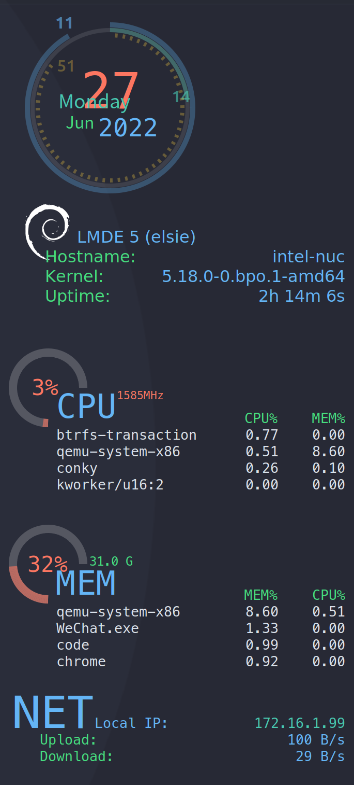

# Conky主题配置
> 自用的, 喜欢的可以下载.





## conky 安装

以`debian`系的`apt`为例

```bash
# 注意, 这里要安装 conky-all, 否则无法支持lua插件
sudo apt install conky-all
```

## 主题安装

下载好, 将项目中的`conky`目录放到`~/.config/`目录中, 重启`conky`即可.


## 说明
> 我这里的配置参数, 是以我的显示器 4k(3840x2160), 然后200%缩放为基准的.  其他人的, 请自行调整.